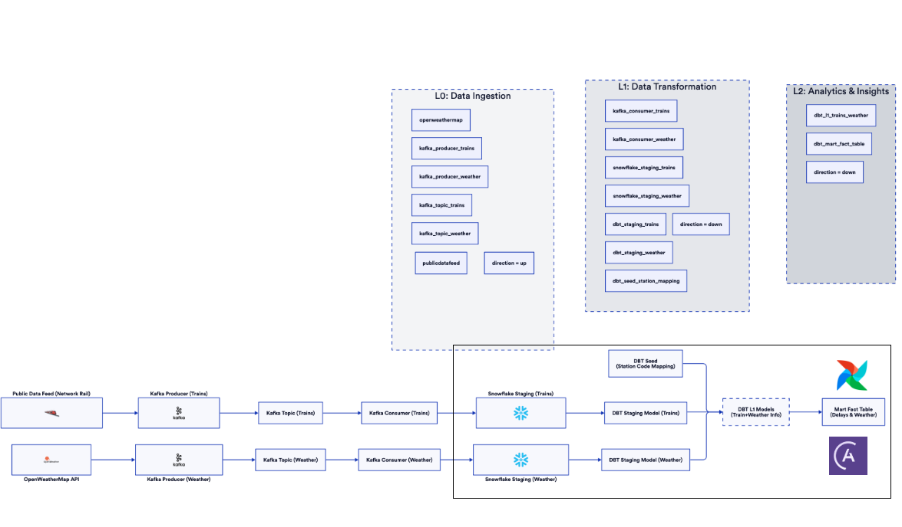

### About
I enrolled in Zach Wilson's Dataexpert.io Data Engineering bootcamp 
In this project, i wanted to work on my learnings on data Engineering. So, I took time to work on a realtime data ingestion, transformation reporting example. My goal is to create a realtime train delay, utilization, weather monitoring application, where users can see the info about train. I have used rail data and weather information for this capstone. More details follow 

## Table of Contents
1. [Capstone Requirements](#capstone-requirements)
2. [Project Overview](#project-overview)
    1. [Problem Statement](#problem-statement)
    2. [KPI and Use cases](#kpi-and-use-cases)
    3. [Data Sources](#data-sources)
    4. [Tables in Snowflake](#data-tables)
    5. [Technologies Used](#technologies-used)
    6. [Why I used these tech](#why-i-used-this-tech)
    7. [Architecture](#architecture)
3. [KPI visualizations](#kpis)
4. [Pipeline](#pipeline)
    1. [Tasks in Dag](#tasks-in-dag)
    2. [DBT tests](#dbt-tests)
    3. [Astronomer Cloud](#deployed-in-astronomer-cloud)
5. [Challenges](#challenges-and-findings)

6. [Next Steps](#next-steps)

## Capstone Requirements

* Identify a problem you'd like to solve.
* Scope the project and choose datasets.
* Use at least 2 different data sources and formats (e.g., CSV, JSON, APIs), with at least 1 million rows.
* Define your use case: analytics table, relational database, dashboard, etc.
* Choose your tech stack and justify your choices.
* Explore and assess the data.
* Identify and resolve data quality issues.
* Document your data cleaning steps.
* Create a data model diagram and dictionary.
* Build ETL pipelines to transform and load the data.
* Run pipelines and perform data quality checks.
* Visualize or present the data through dashboards, applications, or reports.
* Your data pipeline must be running in a production cloud environment

## Project Overview
This project is a real-time data pipeline that works with multiple services like kafka, Snowflake, Airflow, DBT and streamlit to monitor train movements and weather data.

### Problem Statement
* Passengers of UK rail network has an ask. They want to check the status of a train at a particular station, check for delays based on weather conditions. This will help them plan accordingly to avoid waiting for the train in bad weather.
* Additionally, the authorities would like to monitor the delays in train, optimizing the platform utilization in a station such that there will be less operating costs and less resources being used for maintaining the stations.

### KPI and Use cases
1. Total Movements

Measurement: Total train movements in selected period

Use Case: Capacity planning and infrastructure utilization analysis

Outcome: Identifies peak operational periods for resource allocation

2. Avg Delay (Minutes)

Measurement: Mean delay across all movements

Use Case: Service quality benchmarking and SLA monitoring

Outcome: Helps prioritize delay reduction strategies and maintenance planning

3. On-Time Performance %

Measurement: Percentage of trains with ≤2 minute delays

Use Case: Passenger experience optimization

Outcome: Reveals operational consistency for schedule adherence improvements

4. Temp-Delay Correlation

Measurement: Pearson correlation between temperature and delays

Use Case: Environmental impact analysis

Outcome: Quantifies weather effects for predictive model feature engineering

5. Time Variance

Measurement: Average schedule vs actual time difference

Use Case: Timetable validation

Outcome: Highlights systemic scheduling inaccuracies for optimization

### Advanced Analytics
6. Station Compliance Rates

ML Potential: Cluster analysis for station performance grouping

Use Case: Infrastructure investment prioritization

Outcome: Reveals station-specific operational patterns for targeted improvements

7. 7-Day Delay Trend

ML Potential: Time series forecasting input

Use Case: Pattern recognition in operational performance

Outcome: Enables proactive capacity planning for anticipated delays

8. Extreme Weather Alerts

ML Potential: Anomaly detection training data

Use Case: Operational resilience planning

Outcome: Quantifies weather risks for contingency planning

### Real-Time Features
9. Next Hour Departures/Arrivals

ML Integration: Live data for reinforcement learning models

Use Case: Dynamic resource allocation

Outcome: Enables real-time operational adjustments

10. Train Reliability Index

ML Potential: Predictive maintenance trigger

Use Case: Asset performance management

Outcome: Identifies chronic underperformers for deep maintenance analysis

### Data Sources
The project uses three datasources, out of which two are real-time APIs, one is a static dataset. They are

* [Network Rail Open Data Platform](https://publicdatafeeds.networkrail.co.uk/) : This is a real-time API that generates train movement data from all train companies across UK.
The following image shows the data description from the API. 

Data description [Source](https://wiki.openraildata.com/index.php/Train_Movement)


The response from the API 

```json
{
   "metadata":{
      "msg_type":"0003",
      "msg_queue_timestamp":"1740860230000",
      "source_system_id":"TRUST",
      "original_data_source":"SMART"
   },
   "data":{
      "train_id":"879J66MY01",
      "actual_timestamp":"1740860280000",
      "loc_stanox":"87911",
      "gbtt_timestamp":"1740860280000",
      "planned_timestamp":"1740860250000",
      "planned_event_type":"ARRIVAL",
      "event_type":"ARRIVAL",
      "event_source":"AUTOMATIC",
      "correction_ind":"false",
      "offroute_ind":"false",
      "direction_ind":"UP",
      "platform":" 2",
      "route":"0",
      "train_service_code":"22729000",
      "division_code":"88",
      "toc_id":"88",
      "timetable_variation":"1",
      "variation_status":"LATE",
      "next_report_stanox":"87909",
      "next_report_run_time":"1",
      "train_terminated":"false",
      "delay_monitoring_point":"true",
      "reporting_stanox":"87911",
      "auto_expected":"true"
   },
   "processing_ts":1740860232481,
   "source":"network_rail"
}
```

* [Open Weather API](https://openweathermap.org/api): 
Real-time weather data for any place in the world using the city name. 

Data Description : The API call and the response follows [Source](https://openweathermap.org/current#bulk)

The response from the openweather API looks like the below

```json
 {
   "coord":{
      "lon":151.7765,
      "lat":-32.9272
   },
   "weather":[
      {
         "id":800,
         "main":"Clear",
         "description":"clear sky",
         "icon":"01d"
      }
   ],
   "base":"stations",
   "main":{
      "temp":21.3,
      "feels_like":21.84,
      "temp_min":19.87,
      "temp_max":22.06,
      "pressure":1013,
      "humidity":90,
      "sea_level":1013,
      "grnd_level":1012
   },
   "visibility":10000,
   "wind":{
      "speed":1.03,
      "deg":10
   },
   "clouds":{
      "all":0
   },
   "dt":1740860794,
   "sys":{
      "type":2,
      "id":2009459,
      "country":"AU",
      "sunrise":1740858135,
      "sunset":1740904099
   },
   "timezone":39600,
   "id":2155472,
   "name":"Newcastle",
   "cod":200
}
 ```

 ### Data Tables
#### L0
* In my L0, I have two tables, train_movement and weather_data that consume data from kafka
### L1
From my L0, I remove unnecessary column, perform data quality checks, and create L1. L1 comprises of two tables, stg_weather_data and stg_train_movement, both these tables are created and updated by DBT
#### L2
For my L2, I take in my L1 and create a fact table that has the information of train, route and weather data. It has information of rote mapping to a particular city and station


### Technologies Used

The project uses the following technologies

Kafka: Acts as both a message producer for real-time API data and temporary storage until data is consumed and loaded into Snowflake.

Snowflake: Functions as your data warehouse with a three-layer architecture (storage, compute/query processing, and cloud services), offering scalability and near-zero management overhead.

Airflow: Provides workflow management through Directed Acyclic Graphs (DAGs) that define task dependencies and execution order, enabling you to author, schedule, and monitor complex data pipelines.

Astronomer: A managed platform built on top of Apache Airflow that simplifies deployment, scaling, and monitoring while adding enterprise-grade features and reducing operational complexity6911.

Snowpark: Allows you to query Snowflake data using Python, extending Snowflake's capabilities beyond SQL.

DBT: Handles data transformations and testing within your data pipeline.

Streamlit: Creates interactive dashboards to visualize your data and analysis results.

Stomp.py: stomp.py is a Python client library for accessing messaging servers (such as ActiveMQ, Artemis or RabbitMQ) using the STOMP protocol

### why I used this tech
The main goal of my capstone project is to implement however possible technologies i learnt in the bootcamp. I used snowflake shop as it gives me incredible flexibility from consuming messages from my kafka topics, writing tests in dbt and using streamlit dashboard. However I could have used Apache Flink as my project involves realtime rail network analysis, I could not get it working this time, But that is one of my next steps to use flink for stream processing.

### Architecture



The flow is as follows

I have a stomp server that is continuously running and hitting the public datafeed api and producing the evnts into a kafka topic, at the same time, there is a consumer that consumes messages from kafka topic and puts them in snowflake. 

There is another API i'm getting weather from called openweather map api, there is another server that constantly hits this api every 10 minutes to fetch the data from it, as climate wont necessarily change that often. It puts the events into kafka and there is a consumer that takes in and puts these into snowflake

I also have a station codes table which is in dbt as a seed, will have station code to station name mapping in snowflake.

These are my L0 level datasets

Once i receive my L0 level datasets, I have orchestration with airflow and dbt. My airflow dag runs every 1 minute to fetch the latest train information along with weather data and computes One Big Table that is useful for analytics.


### KPIs

These are some of the KPIs i used which i mentioned [above](#kpi-and-use-cases)

The dashboard takes in input a date range and inside this range, we can see the following metrics
The dashboard shows us the train movements, delays, weather details and real-time monitoring. It covers the following usecases

* % of train delays in the selected time period
* weather impact on trains
* Weekly analysis of train movements
* realtime-train status


### Pipeline
My Pipeline looks like the below image

My pipeline starts with stomp server that runs continuously, hitting APIs, then they start putting events in snowflake as my L0.
Then my airfow dag runs every minute, cleaning data, joining stations and weather data to create my L1s and L2 (the final fact table) a One Big Table approach. 


#### Tasks in Dag
1. station_codes_seed - This is a static table that maps station codes to station names
2. stg_weather_data - This task takes in the data in snowflake in L0 weather data, cleans it and runs tests on it and creates an L1
3. stg_train_movement - This task takes in the data in snowflake (events ingested from kafka) in L0, cleans it and runs tests on it
4. fact_city_movement - This takes in the L1 from the previous step, weather and train data, joins them to create one big table(OBT), a fact table that is used for creating our dashboards and analysis.

#### DBT tests
* I have incorporated several DBT tests that will help in maintaining data quality
* There are a total of 35 tests ranging from null, unique checks to accepted ranges, positive values etc.

#### Deployed in Astronomer Cloud
Finally, one of the requirement of this bootcamp is to deploy the DAG in production. I deployed my DAG in astronomer cloud


### Challenges and Findings

* There are some station names that seem to be repetitive, so i tried to consolidate them into a single station and map the station codes to it
  
* The API fetches results continuously, when updating the dashboard i had to make sure I'm using the latest train information in real-time analytics

* Getting to work with Apache Flink when the usecase is realtime monitoring. 

### Next steps

This dashboard demonstrates several ML-ready patterns that I can further use to :

* An usecase where a passenger can check the train status in real-time
* Temporal correlation analysis for time series forecasting
* Real-time data streaming potential using Apache Flink
* Anomaly detection foundations through extreme weather tracking
* I can use other datasources like population data around the stations to identify the bottlenecks in existing train network
